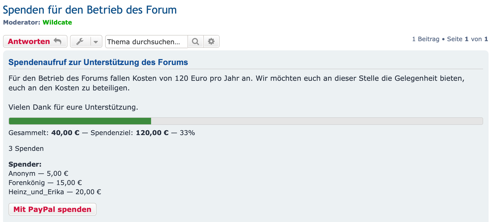

## 1. Was die Erweiterung tut

Spendenkampagnen hängt eine **Spendenkampagne an ein Thema** und zeigt über dem ersten Beitrag
dieses Themas eine Box mit dem Spendenziel, dem gesammelten Betrag, einem Fortschrittsbalken und
– wahlweise – der Anzahl der Spenden und den Namen der Spender.

Zwei Dinge sind vorab wichtig:

- **Es werden nur bestätigte Spenden erfasst.** Eine Spende ist Geld, das *bereits eingegangen* ist
  und das du von Hand einträgst. Die Erweiterung **wickelt keine Zahlungen ab** und nimmt nie
  Kontakt zu PayPal, einer Bank oder einem Zahlungsanbieter auf.
- **Die Spenden-Schaltfläche ist nur ein Link.** Jede Kampagne verweist damit auf eine Web-Adresse
  deiner Wahl (einen PayPal-Link, eine Seite mit Bankdaten, ein anderes Thema …). Wer darauf
  klickt, verlässt das Board; das eingegangene Geld bestätigst du anschließend selbst.

## 2. Installation und Aktivierung

1. Kopiere die Erweiterung nach `ext/uflagmey/donationcampaigns/` auf deinem Board.
2. Gehe zu **Administrationsbereich** → **Anpassen** → **Erweiterungen** → **Donation Campaigns** →
   **Aktivieren**.

Oder auf der Kommandozeile:

```
php bin/phpbbcli.php extension:enable uflagmey/donationcampaigns
php bin/phpbbcli.php cache:purge
```

Beim Aktivieren werden die Datenbanktabellen, die Einstellungen, die Berechtigungen und das
ACP-Menü angelegt. **Deaktivieren** blendet später alles aus, behält aber die Daten; **Löschen**
(Deinstallieren) entfernt alle Kampagnen und Spenden unwiderruflich.

### Update von einer früheren Version

1. **Deaktiviere** die Erweiterung. Klicke *nicht* auf **Daten löschen** – das entfernt alle
   Kampagnen und Spenden.
2. Lade die neuen Dateien **über** die vorhandenen hoch. Überschreiben ist gefahrlos; den alten
   Ordner vorher zu löschen ist nicht nötig, und ohne Löschen bleibt bei einem abgebrochenen Upload
   eine funktionierende Version zurück.
3. **Prüfe, ob der Upload vollständig ist.** Der Ordner der Erweiterung muss **zwölf Unterordner**
   enthalten: `acp`, `adm`, `config`, `controller`, `docs`, `event`, `exception`, `language`,
   `migrations`, `repository`, `service`, `styles`. FTP-Programme lassen manchmal Ordner aus, ohne
   einen deutlichen Fehler zu melden.
4. **Aktiviere** die Erweiterung wieder – dabei laufen die neuen Datenbank-Migrationen – und leere
   den Cache.

> ⚠ **Update von 1.0.0-beta1: Berechtigungen neu vergeben.** beta1 verwendete zwei
> *Moderatoren*-Berechtigungen. Das Update entfernt sie samt ihrer Zuweisungen und ersetzt sie durch
> zwei *Foren*-Berechtigungen, die zunächst niemandem erteilt sind. Vergib sie nach dem Update neu
> (siehe §4). Bestehende Kampagnen und Spenden bleiben unverändert.

## 3. Währung einstellen

Gehe zu **Administrationsbereich** → **Erweiterungen** → **Spendenkampagnen** → **Einstellungen**.

| Einstellung | Bedeutung |
|---|---|
| **Währung** | Dreistelliger Code, z. B. `EUR`, `USD`, `GBP` |
| **Währungssymbol** | Wird neben jedem Betrag angezeigt, z. B. `€` |
| **Symbol vor dem Betrag** | *Nein* (Standard) ergibt „10,00 €“, *Ja* ergibt „€ 10,00“. Gilt für jeden angezeigten Betrag – im Thema, auf den Verwaltungsseiten, im ACP und in den Protokollen |
| **Leerzeichen zwischen Symbol und Betrag** | *Ja* (Standard) hält beide auseinander, *Nein* ergibt z. B. „$10.00“. Das Leerzeichen bricht nie um, Betrag und Symbol bleiben zusammen |
| **Dezimalstellen** | `2` für die meisten Währungen, `0` für Yen, `3` für Dinar |
| **Angezeigte Spender** | Wie viele Spendernamen die öffentliche Box nennt, bevor sie den Rest zusammenfasst |
| **Seite mit der Kampagnenliste anzeigen** | *Nein* (Standard). *Ja* fügt eine Seite mit allen Kampagnen und in den Schnelllinks den Eintrag **Spendenkampagnen** hinzu (siehe §8) |

> ⚠ **Stelle die Dezimalstellen ein, bevor du die erste Spende erfasst.** Beträge werden als ganze
> Zahlen der kleinsten Einheit gespeichert (250,00 € werden als `25000` gespeichert). Eine spätere
> Änderung dieser Einstellung **liest jeden gespeicherten Betrag neu ein**, statt ihn umzurechnen –
> ein Wert kann dadurch plötzlich zehn- oder hundertmal zu groß oder zu klein erscheinen. Die
> Erweiterung warnt dich und verlangt eine Bestätigung, wenn bereits Daten vorhanden sind.

## 4. Festlegen, wer Kampagnen verwalten darf

Die Erweiterung hat **drei Berechtigungen**. Administratoren haben nach der Installation bereits
vollen Zugriff; diesen Abschnitt brauchst du nur, um **anderen Personen** die Mithilfe zu erlauben.

| Berechtigung | Erlaubt dem Inhaber … |
|---|---|
| **Kann Spendenkampagnen verwalten** | Kampagnen erstellen, bearbeiten, aktivieren/deaktivieren und *leere* Kampagnen löschen |
| **Kann bestätigte Spenden verwalten** | Spenden erfassen, bearbeiten und löschen. ⚠ Dies gibt Zugriff auf Spendernamen, **private** Spenderidentitäten und die bestätigten Beträge – vergib sie nur an Personen, denen du diese personenbezogenen Daten anvertraust |
| *(Administrator-Zugriff)* | Alles Obige auf jedem Forum, das der Administrator lesen darf, dazu die Aufsichts- und Wartungsseiten im ACP. Wird den Rollen „Vollständiger Administrator“ und „Standard-Administrator“ automatisch erteilt |

Die beiden Verwaltungs-Berechtigungen sind **Forenberechtigungen**: Du vergibst sie **pro Forum** an
beliebige Benutzer oder Gruppen – Moderatoren oder nicht. Sie sind **unabhängig** – du kannst eine
ohne die andere vergeben. Bei der Installation erhält sie niemand, und sie sind in keiner
Standard-Rolle enthalten.

**Wo du sie einstellst** (die beiden Verwaltungs-Berechtigungen):

1. Reiter **Administrationsbereich** → **Berechtigungen**.
2. Wähle unter **Forenbezogene Berechtigungen** den Punkt **Gruppen-Forenberechtigungen** (oder
   *Benutzer-Forenberechtigungen*).
3. Wähle die **Gruppe** (oder den Benutzer) und dann das **Forum**.
4. Klicke auf **Erweiterte Berechtigungen** und öffne den Reiter **Spendenkampagnen**.
5. Setze die Berechtigungen auf **Ja** und klicke auf **Berechtigungen übernehmen**.

**Lesen ist Voraussetzung.** Wer eine Kampagne verwalten soll, muss das Forum auch lesen dürfen
(*Kann Forum lesen*). Ohne Leserecht erscheinen weder der Menüpunkt noch die Schaltfläche
**Verwalten** – das gilt auch für Administratoren.

> **Hinweis:** Die Berechtigungen geben nichts weiter: **keinen Zugang zum
> Moderatoren-Kontrollzentrum**, keine anderen Moderationsrechte, und der Inhaber wird **nicht als
> Moderator** des Forums aufgeführt.

> **Zum Ausprobieren:** Teste die Rechte mit einem gewöhnlichen Benutzerkonto, nicht mit deinem
> eigenen. Administratoren und Gründer dürfen über den Administrator-Zugriff ohnehin alles und
> sehen deshalb immer jede Schaltfläche – ob die Forenberechtigungen richtig gesetzt sind, zeigt
> sich nur bei einem Konto ohne Administratorrechte.

## 5. Eine Kampagne erstellen

Kampagnen werden **aus dem Thema heraus erstellt**, zu dem sie gehören – es gibt keine Themen-ID
einzutragen.

1. Öffne das Thema.
2. Klicke auf **Themenwerkzeuge** (das Schraubenschlüssel-Symbol) → **Spendenkampagne**.
3. Fülle das Formular aus:

| Feld | Hinweise |
|---|---|
| **Titel** | Die Überschrift der öffentlichen Box |
| **Beschreibung** | Optional. BBCode, Smilies und Links sind erlaubt |
| **Spendenziel** | Zum Beispiel `250,00` oder `250.00`. Muss größer als null sein |
| **Spendenlink** | Optional. Eine vollständige `http://`- oder `https://`-Adresse |
| **Linktext** | Der Text auf der Schaltfläche, z. B. *Über PayPal spenden*. Erforderlich, wenn ein Link gesetzt ist |
| **Spendernamen anzeigen** | Ob die öffentliche Box Spendernamen nennen darf |
| **Anzahl der Spenden anzeigen** | Ob die Box zeigt, wie viele Spenden es gibt |
| **Spendendatum anzeigen** | Ob die Spenderliste neben Name und Betrag auch das Datum jeder Spende zeigt. Wirkt nur, wenn Spendernamen angezeigt werden. Bei neuen Kampagnen vorausgewählt |

4. Klicke auf **Absenden**, dann auf **Zurück zum Thema** – die Box erscheint nun über dem ersten
   Beitrag.

Eine Kampagne pro Thema. Derselbe Menüpunkt **Spendenkampagne** öffnet später die
**Verwaltungsseite** dieser Kampagne.

> **Datenschutz beim Spendendatum:** Datum und Betrag zusammen können in einer kleinen Gemeinschaft
> auch eine *anonyme* Spende einer Person zuordenbar machen. Schalte das Datum nur ein, wenn das für
> deine Kampagne in Ordnung ist.

## 6. Eine bestehende Kampagne verwalten

Klicke in der Kampagnen-Box auf die Schaltfläche **Verwalten** – oder öffne das Thema →
**Themenwerkzeuge** → **Spendenkampagne**. Die Schaltfläche **Verwalten** sehen nur Personen, die
in diesem Forum eine der beiden Verwaltungs-Berechtigungen haben (oder Administratoren); Besucher
sehen sie nicht. Bei einer *deaktivierten* Kampagne wird die Box nicht angezeigt – dann führt der
Weg über die Themenwerkzeuge.

Die Verwaltungsseite zeigt den Status der Kampagne und ihre Spenden, mit Schaltflächen für die
Aktionen, die du ausführen darfst:

- **Kampagne bearbeiten** – Titel, Spendenziel, Link usw. ändern.
- **Deaktivieren / Aktivieren** – *Deaktivieren* blendet die Box aus dem Thema aus, behält aber
  jede Spende; *Aktivieren* holt sie zurück.
- **Löschen** – nur möglich, solange die Kampagne **keine** Spenden hat. Eine Kampagne mit Spenden
  muss stattdessen deaktiviert werden (ein Administrator kann sie im ACP endgültig löschen, wenn sie
  wirklich weg soll).

## 7. Eine Spende erfassen

**Erst, nachdem das Geld tatsächlich eingegangen ist und du es geprüft hast.**

1. Öffne die Verwaltungsseite (**Verwalten** in der Box oder **Themenwerkzeuge** →
   **Spendenkampagne**).
2. Klicke auf **Bestätigte Spende erfassen** (wird Inhabern von *Kann bestätigte Spenden verwalten*
   angezeigt).
3. Trage den Beleg ein:

| Feld | Hinweise |
|---|---|
| **Betrag** | Der tatsächlich eingegangene Betrag, `50,00` oder `50.00` |
| **Eingegangen am** | Das Datum, an dem das **Geld eingegangen** ist, nicht das heutige |
| **Spender** | Der öffentlich anzuzeigende Name. Leer lassen, um die Spende als *Anonym* zu erfassen |
| **Spender öffentlich anzeigen** | Abwählen, um die Spende zu zählen, aber den Namen zu verbergen |

4. Klicke auf **Absenden** – die Kampagnensumme wird sofort neu berechnet.

Die Spendenliste der Verwaltungsseite zeigt zu jeder Spende auch, wann sie **eingegangen** ist.
Jede Spende in der Liste hat die Aktionen **Bearbeiten** und **Löschen**. Eine Spende mit verborgenem
Namen **zählt trotzdem** zur Summe und zur Spendenanzahl; nur der Name wird zurückgehalten und als
*Anonym* angezeigt.

> **Frage einen Spender, bevor du seinen Namen veröffentlichst.** Die Erweiterung kann nicht
> wissen, ob seine Einwilligung vorliegt.

## 8. Was deine Besucher sehen

Im Thema, über dem ersten Beitrag, zeigt die Box den Titel, die optionale Beschreibung, einen
Fortschrittsbalken, den gesammelten Betrag gegenüber dem Spendenziel und – je nach Einstellung der
Kampagne – die Spendenanzahl, die Liste der Spendernamen und das Datum jeder Spende. Jede bestätigte
Spende ist mit ihrem Betrag enthalten; eine private Spende erscheint als *Anonym* mit ihrem Betrag,
wird also nie verborgen.



Mit eingeschaltetem Spendendatum sieht ein Eintrag der Spenderliste so aus:
„Forenkönig — 15,00 € (03.10.2026)“.

### Die Kampagnenliste

Hat der Administrator **Seite mit der Kampagnenliste anzeigen** eingeschaltet (§3), bieten die
Schnelllinks den Eintrag **Spendenkampagnen**. Die Seite listet die Kampagnen, die neuesten zuerst,
25 pro Seite: den Kampagnentitel (ein Link zum Thema), das Forum, den Fortschrittsbalken, den
gesammelten Betrag gegenüber dem Spendenziel mit Prozentangabe und – wenn die Kampagne sie zeigt –
die Anzahl der Spenden. **Spendernamen erscheinen dort nie**; sie bleiben im Thema.

Jeder Besucher sieht nur die Kampagnen, deren Box er auch im Thema sehen könnte: aktivierte
Kampagnen in Foren, die er lesen darf, in freigegebenen und nicht gelöschten Themen und nicht in
einem passwortgeschützten Forum, dessen Passwort er noch nicht eingegeben hat. Gäste sehen also die
Kampagnen in den Foren, die Gäste lesen dürfen. Eine Kampagne, die ihr Ziel erreicht hat, wird wie
die anderen gelistet, mit vollem Balken.

## 9. Verwaltung und Aufsicht (ACP)

Das ACP (**Administrationsbereich** → **Erweiterungen** → **Spendenkampagnen**) dient der **Aufsicht
und Wartung**, nicht der täglichen Erfassung:

- **Kampagnen** – eine schreibgeschützte Liste aller Kampagnen des Boards. Die Zeilen-Links öffnen
  die Kampagne in ihrem Thema.
- **Spenden** – eine schreibgeschützte Liste der Spenden einer Kampagne, mit einem Link, um sie im
  Thema zu verwalten.
- **Summe neu berechnen** – berechnet die gespeicherte Summe einer Kampagne aus ihren Spenden neu
  (jederzeit gefahrlos möglich; nützlich nach einem zurückgespielten Backup).
- **Löschen** – ein Administrator darf hier auch eine **nicht leere** Kampagne löschen (dabei werden
  ihre Spenden mit entfernt); die Bestätigung nennt die Kampagne und ihre Spendenanzahl.

**Wo Aktionen protokolliert werden:** Was aus einem Thema heraus geschieht, wird im
**Moderationsprotokoll** festgehalten, bezogen auf Forum und Thema – auch dann, wenn die handelnde
Person kein Moderator ist. Du findest es unter **Administrationsbereich** → **Wartung** →
**Moderations-Protokoll** (Moderatoren dieses Forums auch im Moderatoren-Kontrollzentrum). Was im
ACP geschieht, wird im **Administrationsprotokoll** festgehalten (**Administrationsbereich** →
**Wartung** → **Administrations-Protokoll**).

## 10. Fehlerbehebung

| Symptom | Prüfen |
|---|---|
| Die Box erscheint nicht im Thema | Ist die Kampagne **aktiviert**? Cache leeren |
| Nach einem Update fehlen Box und Menüpunkt, das ACP funktioniert aber | Der Upload ist unvollständig: Hat der Ordner der Erweiterung alle **zwölf Unterordner** (siehe §2)? Fehlende Ordner hochladen, Erweiterung deaktivieren und wieder aktivieren, Cache leeren |
| Die Summe stimmt nicht | **Summe neu berechnen** im ACP verwenden |
| Beträge sind um Faktor zehn oder hundert daneben | Die Einstellung **Dezimalstellen** wurde nach dem Erfassen von Daten geändert (siehe §3) |
| Ein Spendername erscheint, obwohl er nicht sollte | Beide Schalter prüfen: **Spendernamen anzeigen** der Kampagne **und Spender öffentlich anzeigen** dieser Spende |
| Der Menüpunkt **Spendenkampagne** oder die Schaltfläche **Verwalten** fehlt | Der Benutzer hat auf diesem Forum keine der Verwaltungs-Berechtigungen oder darf das Forum nicht lesen (siehe §4). Nach einem Update von beta1: Berechtigungen neu vergeben (siehe §2) |
| Die Schaltfläche **Bestätigte Spende erfassen** fehlt | Die Berechtigung *Kann bestätigte Spenden verwalten* fehlt – sie ist unabhängig von *Kann Spendenkampagnen verwalten* |
| Ein Testbenutzer sieht alles, obwohl er keine Berechtigungen hat | Ist er Administrator oder Gründer? Dann greift der Administrator-Zugriff (siehe §4) |
| Die Kampagnenliste meldet, dass die Seite nicht gefunden wurde | **Seite mit der Kampagnenliste anzeigen** ist ausgeschaltet (Standard, siehe §3). Nach einem Update: Cache leeren |
| Eine Kampagne fehlt in der Kampagnenliste | Ist sie **aktiviert**? Darf der Besucher das Forum lesen? Ist das Forum passwortgeschützt und das Passwort noch nicht eingegeben? (siehe §8) |

---

*Ausführlichere Informationen enthalten die mit der Erweiterung ausgelieferten Dokumente
`README.md`, `docs/ADMIN_GUIDE.md` und `docs/PRIVACY.md` (in englischer Sprache).*
