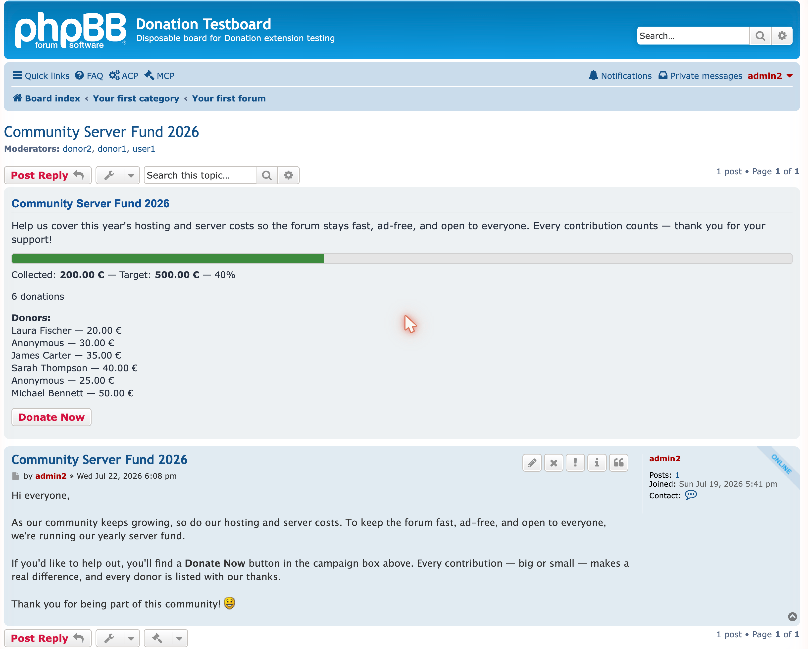

## 1. What it does

Donation Campaigns attaches a **fundraising campaign to a topic** and shows a box above that topic's
first post with the target amount, the amount collected, a progress bar and — optionally — the
number of donations and the donors' names.

Two things are important before you start:

- **It records confirmed donations only.** A donation is money that has *already arrived* and that
  you enter by hand. The extension **does not process payments** and never talks to PayPal, a bank
  or any provider.
- **The "donate" button is just a link.** Each campaign points it at a web address you choose (a
  PayPal link, a bank-details page, another topic…). Whoever clicks it leaves the board; you confirm
  the money yourself afterwards.

## 2. Install and enable

1. Copy the extension to `ext/uflagmey/donationcampaigns/` on your board.
2. Go to **ACP** → **Customise** → **Extensions** → **Donation Campaigns** → **Enable**.

Or from the command line:

```
php bin/phpbbcli.php extension:enable uflagmey/donationcampaigns
php bin/phpbbcli.php cache:purge
```

Enabling creates the database tables, the settings, the permissions and the ACP menu. **Disabling**
later hides everything but keeps your data; **purging** (uninstalling) deletes all campaigns and
donations permanently.

### Update from an earlier version

1. **Disable** the extension. Do *not* click **Delete data** — that removes every campaign and
   donation.
2. Upload the new files **over** the existing ones. Overwriting is safe; there is no need to delete
   the old folder first, and not deleting it means an interrupted upload leaves a working version
   behind.
3. **Check the upload is complete.** The extension folder must contain **twelve folders**: `acp`,
   `adm`, `config`, `controller`, `docs`, `event`, `exception`, `language`, `migrations`,
   `repository`, `service`, `styles`. FTP clients can skip folders without an obvious error.
4. **Enable** the extension again — this runs any new database migrations — and purge the cache.

> ⚠ **Updating from 1.0.0-beta1: re-assign the permissions.** beta1 used two *moderator*
> permissions. The update removes them together with their grants and replaces them with two
> *forum* permissions, granted to nobody. Assign them again after updating (see §4). Existing
> campaigns and donations are not affected.

## 3. Configure the currency

Go to **ACP** → **Extensions** → **Donation campaigns** → **Settings**.

| Setting | Meaning |
|---|---|
| **Currency code** | Three letters, e.g. `EUR`, `USD`, `GBP` |
| **Currency symbol** | Shown next to every amount, e.g. `€` |
| **Symbol before the amount** | *No* (default) gives "10.00 €", *Yes* gives "€ 10.00". Applies to every amount shown — on the topic, the management pages, in the ACP and in the logs |
| **Space between symbol and amount** | *Yes* (default) keeps them apart, *No* gives e.g. "$10.00". The space never wraps, so amount and symbol stay together |
| **Decimal places** | `2` for most currencies, `0` for yen, `3` for dinar |
| **Donors listed** | How many donor names the public box shows before summarising the rest |

> ⚠ **Set the decimal places before recording your first donation.** Amounts are stored as whole
> numbers of the smallest unit (250.00 € is stored as `25000`). Changing this setting later
> **re-reads every stored amount** rather than converting it, so a figure can suddenly appear ten or
> a hundred times too big or small. The extension warns you and asks for confirmation if data
> already exists.

## 4. Decide who may manage campaigns

The extension has **three permissions**. Administrators already have full access after
installation, so you only need this section to let **other people** help.

| Permission | Lets the holder… |
|---|---|
| **Manage donation campaigns** | Create, edit, enable/disable and delete *empty* campaigns |
| **Manage confirmed donations** | Add, edit and delete donations. ⚠ This exposes donor names, **private** donor identities and confirmed amounts — grant it only to people you trust with that personal data |
| *(Administrator access)* | Everything above on every forum the administrator can read, plus the ACP oversight and maintenance pages. Granted to the Full and Standard Administrator roles automatically |

The two management permissions are **forum permissions**: you grant them **per forum** to any user
or group — moderators or not. They are **independent** — you can give someone one without the
other. Nobody holds them after installation, and no default role contains them.

**Where to set them** (the two management permissions):

1. **ACP** → **Permissions** tab.
2. Under **Forum based permissions**, choose **Group forum permissions** (or *User forum
   permissions*).
3. Select the **group** (or user), then the **forum**.
4. Click **Advanced Permissions** and open the **Donation Campaigns** tab.
5. Set the permissions to **Yes** and click **Apply permissions**.

**Read access is required.** Whoever manages a campaign must also be able to read the forum
(*Can read forum*). Without it, neither the menu entry nor the **Manage** button appears — for
administrators too.

> **Note:** the permissions grant nothing else: **no access to the Moderator Control Panel**, no
> other moderator ability, and the holder is **not listed as a moderator** of the forum.

> **When trying it out:** test the permissions with an ordinary member account, not your own.
> Administrators and founders can do everything through administrator access and therefore always
> see every button — whether the forum permissions are set correctly only shows for an account
> without administrator rights.

## 5. Create a campaign

Campaigns are **created from the topic they belong to** — there is no topic number to type in.

1. Open the topic.
2. Click **Topic tools** (the wrench icon) → **Donation campaign**.
3. Fill in the form:

| Field | Notes |
|---|---|
| **Title** | The heading of the public box |
| **Description** | Optional. BBCode, smilies and links are allowed |
| **Target amount** | For example `250.00` or `250,00`. Must be above zero |
| **Donation link** | Optional. A full `http://` or `https://` address |
| **Link text** | The words on the button, e.g. *Donate via PayPal*. Required if a link is set |
| **Show donor names** | Whether the public box may list donor names |
| **Show donation count** | Whether the box shows how many donations there are |
| **Show donation date** | Whether the donor list shows the date of each donation next to name and amount. Only has an effect when donor names are shown. Ticked for new campaigns |

4. Click **Submit**, then **Back to topic** — the box now appears above the first post.

One campaign per topic. The same **Donation campaign** menu entry later opens the **management
page** for that campaign.

> **Privacy and the donation date:** in a small community, date and amount together can make even
> an *anonymous* donation traceable to a person. Only switch the date on if that is acceptable for
> your campaign.

## 6. Manage an existing campaign

Click the **Manage** button in the campaign box — or open the topic → **Topic tools** →
**Donation campaign**. The **Manage** button is shown only to people who hold either management
permission on that forum (or administrators); visitors do not see it. A *disabled* campaign shows no
box, so then the way in is through the topic tools.

The management page shows the campaign's status and its donations, with buttons for the actions you
are allowed to perform:

- **Edit campaign** — change the title, target, link, etc.
- **Disable / Enable** — *Disable* hides the box from the topic but keeps every donation; *Enable*
  brings it back.
- **Delete** — only possible while the campaign has **no** donations. A campaign with donations must
  be disabled instead (an administrator can hard-delete it from the ACP if it really must go).

## 7. Record a donation

**Only after the money has actually arrived and you have checked it.**

1. Open the management page (**Manage** in the box, or **Topic tools** → **Donation campaign**).
2. Click **Add confirmed donation** (shown to holders of *Manage confirmed donations*).
3. Fill in the receipt:

| Field | Notes |
|---|---|
| **Amount** | The amount that actually arrived, `50.00` or `50,00` |
| **Received on** | The date the **money arrived**, not today's date |
| **Donor** | The name to show publicly. Leave empty to record it as *Anonymous* |
| **Show donor publicly** | Untick to count the donation but hide the donor's name |

4. Click **Submit** — the campaign total is recalculated immediately.

The donation list on the management page also shows when each donation was **received**. Each
donation in the list has **Edit** and **Delete** actions. A donation with its name hidden
**still counts** towards the total and the donation count; only the name is withheld and shown as
*Anonymous*.

> **Ask a donor before publishing their name.** The extension cannot know whether you have their
> consent.

## 8. What your visitors see

On the topic, above the first post, the box shows the title, the optional description, a progress
bar, the amount collected against the target, and — depending on the campaign's settings — the
donation count, the list of donor names and the date of each donation. Every confirmed donation is
included with its amount; a private donation appears as *Anonymous* with its amount, never hidden.



With the donation date switched on, a donor-list entry reads like this:
"Laura Fischer — 20.00 € (3 Oct 2026)".

## 9. Administrator oversight

The ACP (**ACP** → **Extensions** → **Donation campaigns**) is for **oversight and maintenance**, not
day-to-day entry:

- **Campaigns** — a read-only list of every campaign on the board. Its row links open the campaign
  on its topic.
- **Donations** — a read-only list of a campaign's donations, with a link to manage them on the
  topic.
- **Recalculate total** — rebuilds a campaign's stored total from its donations (safe to run any
  time; useful after a restored backup).
- **Delete** — an administrator may delete even a **non-empty** campaign here (this cascades its
  donations); the confirmation names the campaign and its donation count.

**Where actions are logged:** work done from a topic is recorded in the **moderator log**, scoped to
the forum and topic — also when the person acting is not a moderator. Read it under **ACP** →
**Maintenance** → **Moderator log** (moderators of that forum also find it in the MCP). Work done in
the ACP is recorded in the **administrator log** (**ACP** → **Maintenance** → **Admin log**).

## 10. Troubleshooting

| Symptom | Check |
|---|---|
| The box does not appear on the topic | Is the campaign **enabled**? Purge the cache |
| After an update the box and the menu entry are gone, but the ACP works | The upload is incomplete: does the extension folder contain all **twelve folders** (see §2)? Upload the missing folders, disable and re-enable the extension, purge the cache |
| The total looks wrong | Use **Recalculate total** in the ACP |
| Amounts are off by a factor of ten or a hundred | The **decimal places** setting was changed after data was recorded (see §3) |
| A donor's name shows when it should not | Check both switches: the campaign's **Show donor names** **and** that donation's **Show donor publicly** |
| The **Donation campaign** menu entry or the **Manage** button is missing | The user has neither management permission on that forum, or cannot read the forum (see §4). After an update from beta1: re-assign the permissions (see §2) |
| The **Add confirmed donation** button is missing | The *Manage confirmed donations* permission is missing — it is independent of *Manage donation campaigns* |
| A test user sees everything without holding the permissions | Is the user an administrator or founder? Then administrator access applies (see §4) |

---

*More detail is in the full documentation shipped with the extension: `README.md`,
`docs/ADMIN_GUIDE.md` and `docs/PRIVACY.md`.*
